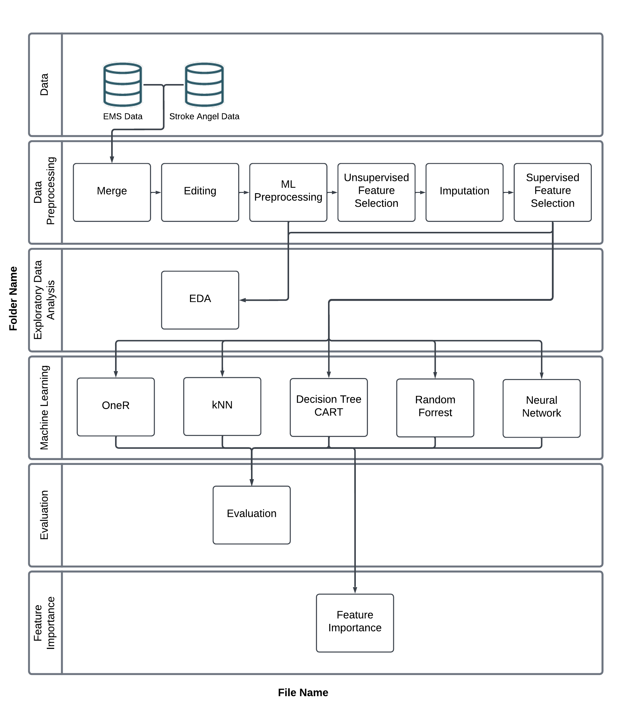

# Prehospital Stroke Triage Publication

## Overview

This code repository contains the complete R code generated and used in our paper\
“Explainable Artificial Intelligence for Prehospital Stroke Triage: A Retrospective Proof-of-Concept Study Using Digital Real-World Data Identifying Candidates for Thrombectomy”.

In this study, we developed a proof-of-concept of machine learning models to identify candidates for endovascular therapy.

------------------------------------------------------------------------

## How to Use

**Requirements**

Use [RStudio Desktop](https://posit.co/download/rstudio-desktop/) or [Posit Cloud](https://posit.cloud/?_gl=1*e3y0vv*_ga*Njc1OTY5NjQ4LjE3NjQwMTc5NTg.*_ga_2C0WZ1JHG0*czE3NjQ3NzYwNDQkbzYkZzEkdDE3NjQ3Nzg1NDUkajYwJGwwJGgw) to run the Quarto scripts. These scripts contain only R code.

The code was developed and tested with R version 4.5.2.

Key R packages:

-   tidymodels
-   DALEX
-   ggplot2
-   dplyr
-   tidyr

Get the Code

First, download the repository to your local machine.

-   If you use GitHub, clone the repository into a new R project.
-   If you are not a GitHub user, click “Download ZIP” and extract the files.

You can clone the repository via the command line:

``` bash
git clone https://github.com/moser-oliver/prehospital-stroke-triage-R.git
```

**Data**

The data used in this study are not publicly available due to privacy and data protection restrictions.

They can be obtained from the corresponding author upon reasonable request and with appropriate approvals.

## Layout

The code is designed to be run in the sequential order shown in the overview of the file environment. This diagram shows the data flow and how each script is organised into the matching folders used in this repository.



### `Folder: Data`

This folder contains the full raw and unmatched EMS and clinical data and is not included in this repository.

### `Folder: Data Preprocessing`

1.  **Merge**\
    Links the EMS and clinical datasets (record linkage).

2.  **Editing**\
    Performs a preselection of the 215 clinical variables, recodes them, and assigns readable names.

3.  **MLPreprocessing**\
    Applies basic preprocessing, such as aggregating categorical variables and handling outliers.

4.  **Unsupervised Feature Selection (UFS)**\
    Performs unsupervised feature selection by removing highly correlated and low-variance variables.

5.  **Imputation**\
    Compares several imputation methods (mean/mode, kNN k = 1/k = 5, bagged trees) in a test environment.

6.  **Supervised Feature Selection (SFS)**\
    Performs supervised feature selection using a combination of filter, wrapper, and intrinsic (model-based) approaches.

### `Folder: Exploratory Data Analysis`

This folder compares the unprocessed, preprocessed, training, and test data in a cross-table to check whether the groups differ from each other, which they ideally should not. The optimal resampling method (downsampling, upsampling, or a combination) is tuned separately for each machine learning algorithm. The script also generates pie charts showing the final EVT ratio in the resampled training data to visualise how this preprocessing step have altered the data distribution.

### `Folder: Machine Learning`

This folder contains the training pipeline for six machine learning models: OneR, kNN, Decision Tree, Random Forest, XGBoost, and neural networks, implemented with tidymodels. The workflow includes preprocessing steps such as bagged tree imputation of missing data and feature scaling, followed by hyperparameter optimisation using racing procedures and grid search. The tuned models are evaluated on the held-out test set and benchmarked against the 4-Item Stroke Scale (4I-SS), with performance metrics and confidence intervals derived from bootstrap resampling.

### `Folder: Evaluation`

We compared the top-performing models using ROC and PRC curves. Following TRIPOD-AI standards, we conducted a risk group analysis by stratifying performance by sex and age. Furthermore, we visualized the stability of performance metrics across all models by comparing bootstrap distributions and confidence intervals.

### `Folder: Feature Importance`

We use the DALEX package to compute feature importance via permutation-based methods and global SHAP values, both at the overall level and for each model separately. All feature importance results are visualised using ggplot2.

## Issues:

Please submit issues via GitHub or via email.

## License:

This study is released under the MIT License. You are free to use, modify, and distribute this software, including for commercial and open-source projects, as long as the original copyright notice and this permission notice are included in all copies or substantial portions of the software.

All code and configuration files in this repository are provided to support scientific reproducibility. Researchers and developers are encouraged to reuse and adapt them for their own work, and to cite this repository where appropriate.

## Authors:

Patrick Andreas Eder<sup>a,b</sup>, Oliver Moser<sup>b,c</sup>, Asarnusch Rashid<sup>b</sup>, Eckhard Schlemm<sup>d</sup>, Jasmin Hessler<sup>b</sup>, Holger von Jouanne-Diedrich<sup>c</sup>, Volker Ziegler<sup>e</sup>, Gunter Laux<sup>a</sup>, Hassan Soda<sup>f</sup>

<sup>a</sup> Department of General Practice and Health Services Research, University Hospital Heidelberg, Germany\
<sup>b</sup> Innovationsmanagement, Zentrum für Telemedizin Bad Kissingen, Germany\
<sup>c</sup> Faculty of Engineering, Competence Centre for Artificial Intelligence, TH Aschaffenburg (University of Applied Sciences), Germany\
<sup>d</sup> Department of Neurology, University Medical Center Hamburg-Eppendorf, Germany\
<sup>e</sup> Department of Neurological Rehabilitation, Campus Rhön Klinikum AG, Germany\
<sup>f</sup> Department of Neurology, Campus Rhön Klinikum AG, Germany
